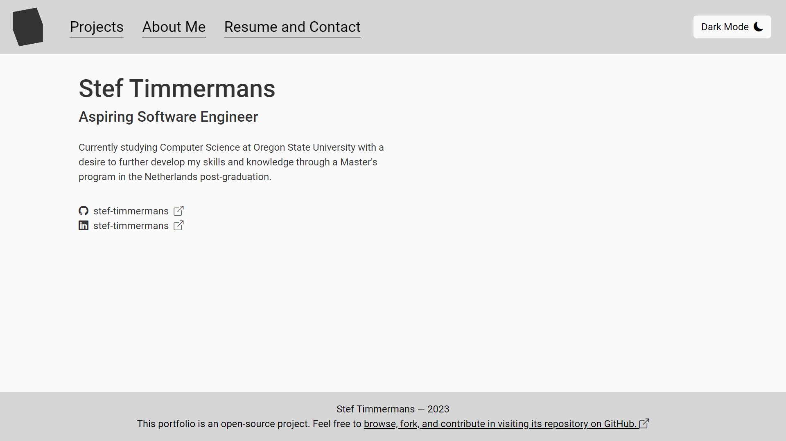

# About My Portfolio Website

## This is the repository for my portfolio website. It's built using Angular and showcases some of my work as a software engineer.

 

 

# Site Structure

**This website consists of the following pages:**

1. **Home:** Here you'll find a brief introduction about me and what I do.

2. **Projects:** This page showcases some of the projects that I've worked on. Each project includes a brief description, the tech stack I used, and a link to the documentation, if applicable.

3. **About Me:** On this page, you'll find more information about me, my skills, and my hobbies outside of the industry.

4. **Resume and Contact:** If you're interested in my work and would like to get in touch, head over to the contact page. There's a form you can fill out to send me an email directly. Due to limitations with GitHub Pages, this form requires an external email application (though all you need to do is verify its contents and hit send). You can also find a Google Drive link to my current resume.

 

# Themes

The website supports both light and dark themes. The theme can be toggled using the button on the website nav. The current theme is saved in your browser, so it'll be remembered next time you visit.

 

# Running Locally

To run this project locally:

1. Clone the repository: `git clone https://github.com/stef-timmermans/stef-timmermans.github.io.git`
2. Install dependencies: `npm install`
3. Start the server: `ng serve`
4. Open a browser and navigate to `http://localhost:4200/`

 

# License Information

This project is licensed under the MIT license. It is partially built using free and open-source software. For more information see `LICENSE` and `NOTICE` in the root directory.
